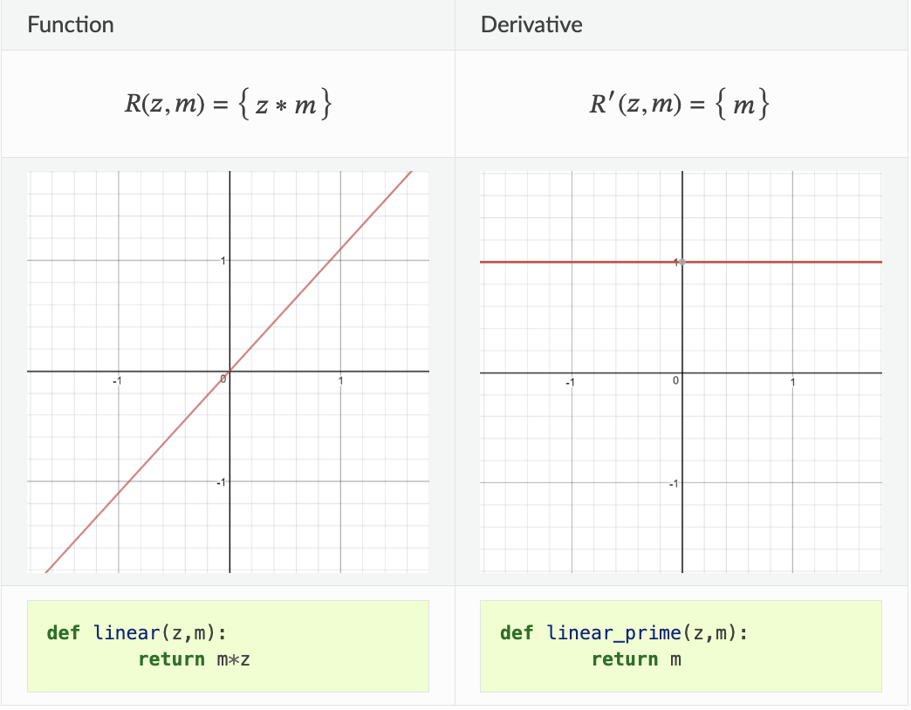
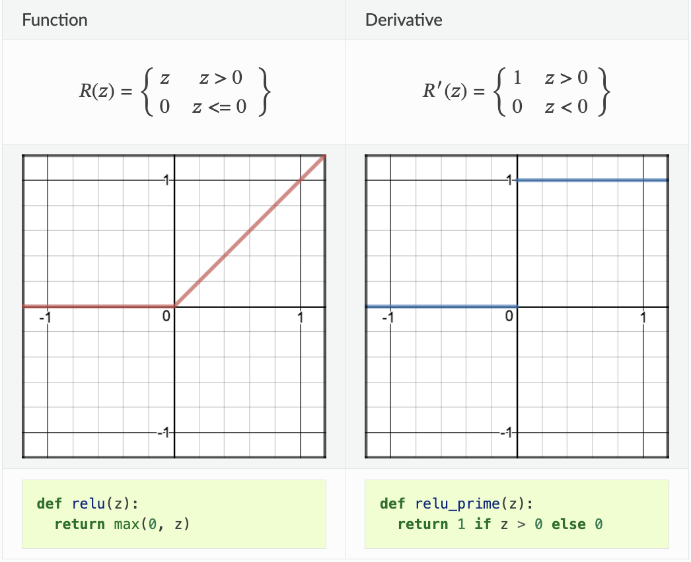
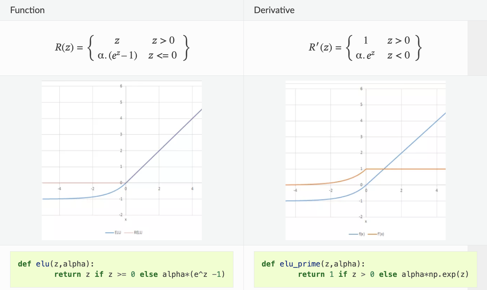
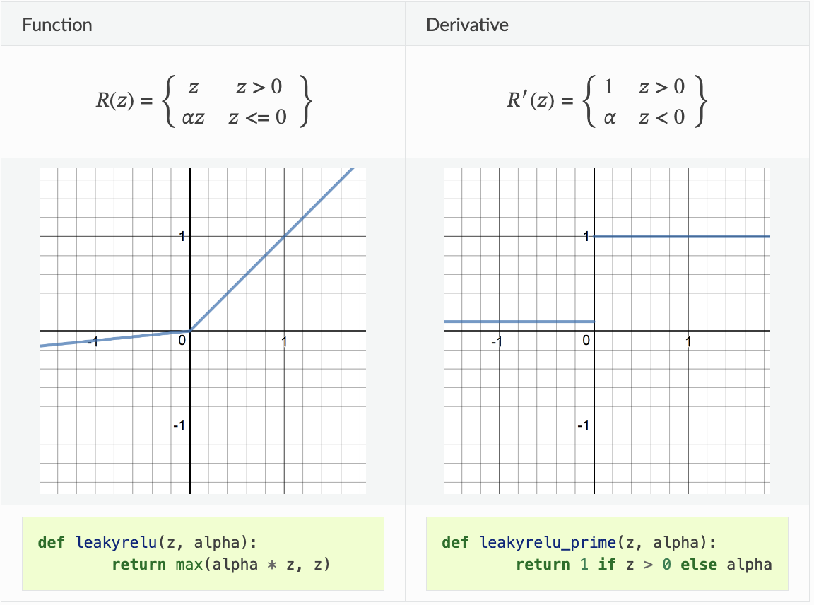
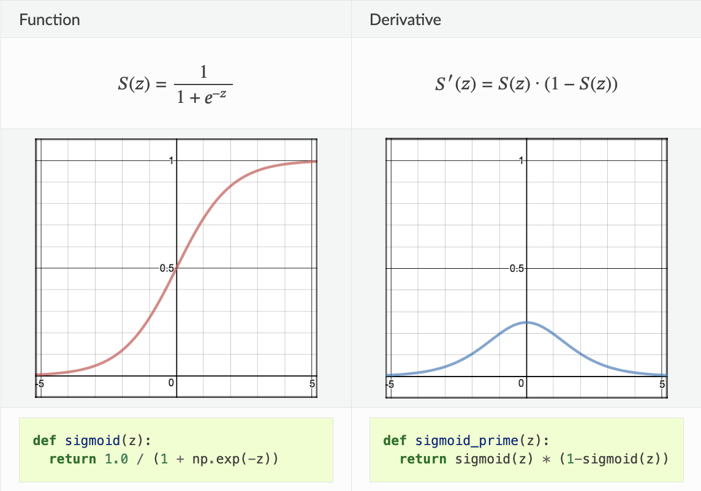
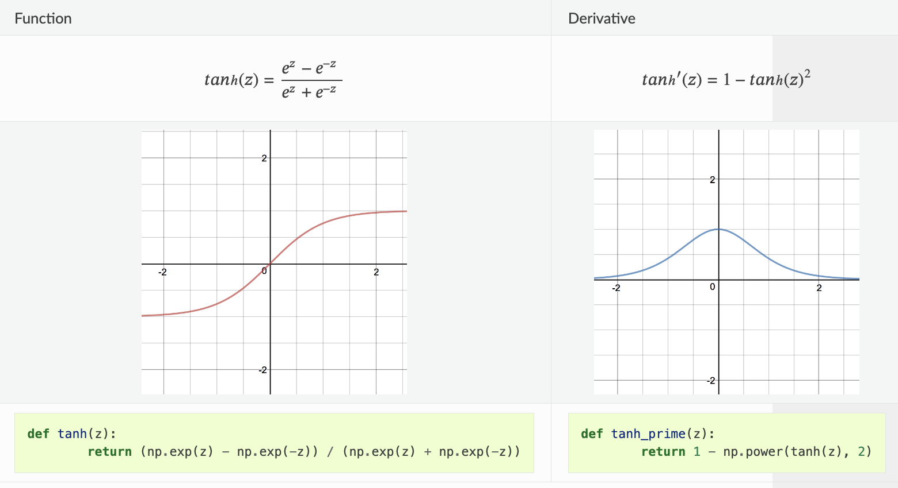
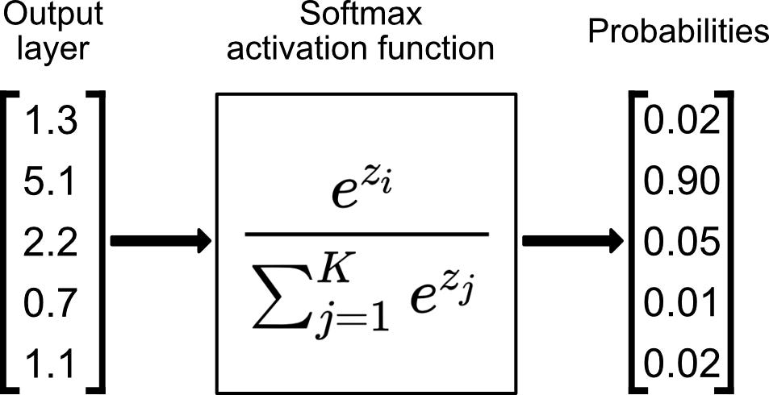

# Activation functions 🕺🏻💃🏼

## Contents:
1. Linear
2. ELU
3. ReLU
4. LeakyReLU
5. Sigmoid
6. Tanh
7. Softmax

---

## 1. Linear activation function

- Linear activation function is equivalent to `no activation function`.

#### Note: Almost never used. 🚫

---

## 2. Rectified Linear Unit (Relu)

- Most used activation function ✅

- Simple, yet powerful. Its non-linear function and performs better than `Sigmoid`.

#### Cons 🚫

- One of its limitations is that it should only be used within hidden layers of a neural network model.

- **`For activations in the region (x<0) of ReLu, gradient will be 0 because of which the weights will not get adjusted during descent. That means, those neurons which go into that state will stop responding to variations in error/ input (simply because gradient is 0, nothing changes). This is called the dying ReLu problem.`**

- The range of ReLu is [0,∞). This means it can blow up the activation.

---

## 3. Exponential Linear Unit (ELU)

- ELU is a function that tend to converge cost to zero faster and produce more accurate results. 

- `ELU has a extra alpha constant which should be positive number.`

- ELU is very similar to RELU except negative inputs. ELU becomes smooth slowly until its output equal to -α whereas RELU sharply smoothes.

- **ELU is a strong alternative to ReLU.** ✅

---

## 4. Leaky Relu

- A leaky ReLU allows a small, non-zero, constant gradient 𝛼 (Normally, 𝛼=0.01).

- **`Leaky ReLUs are one attempt to fix the “dying ReLU” problem by having a small negative slope (of 0.01, or so).`**

- As it possess linearity, it can’t be used for the complex Classification. It **lags behind the Sigmoid and Tanh for some of the use cases**. 🚫

---

## 5. Sigmoid Function 🧑🏻‍✈️

- Sigmoid takes a real value as input and outputs another value between 0 and 1.

- It’s easy to work with and has all the nice properties of activation functions: **`it’s non-linear, continuously differentiable, monotonic, and has a fixed output range.`**

- The output of the activation function is always going to be in range (0,1) compared to (-inf, inf) of linear function. So we have our activations bound in a range. Nice, it won’t blow up the activations then. ✅

#### Cons 🚫

- Towards either end of the sigmoid function, the Y values tend to respond very less to changes in X. It gives rise to a problem of **“vanishing gradients”**.

- `Sigmoids saturate and kill gradients.`

- The network refuses to learn further or is drastically slow ( depending on use case and until gradient /computation gets hit by floating point value limits ).

---

## 6. Tanh (Hyperbolic tangent function)

- Tanh squashes a real-valued number to the range [-1, 1].

- It’s non-linear. But unlike Sigmoid, its output is zero-centered.

- Therefore, in practice the tanh non-linearity is always preferred to the sigmoid nonlinearity. ✅

- The gradient is stronger for tanh than sigmoid ( derivatives are steeper). ✅

- Tanh also has the vanishing gradient problem. 🚫

---

## 7. SoftMax activation function

- Generally used in the output layer of neural networks when we have to predict probabilities of belong to a number of classes.

